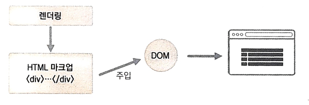
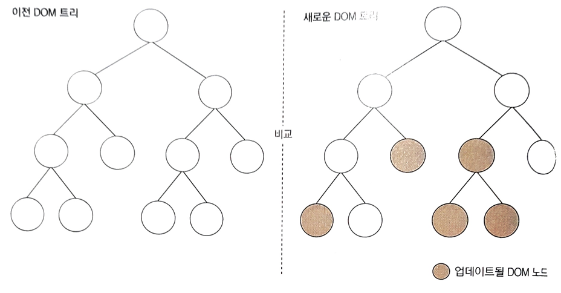
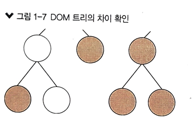
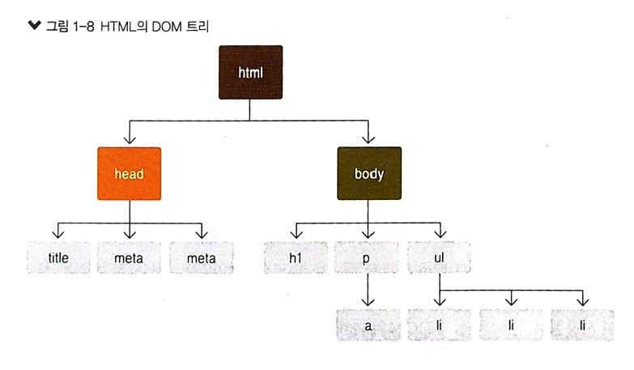
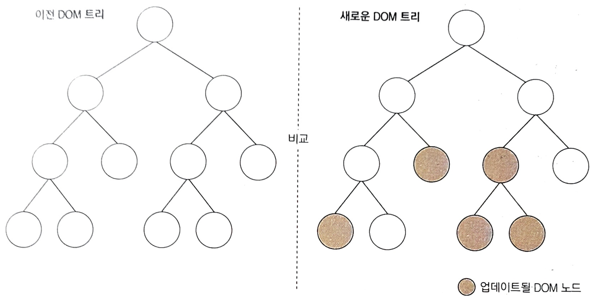
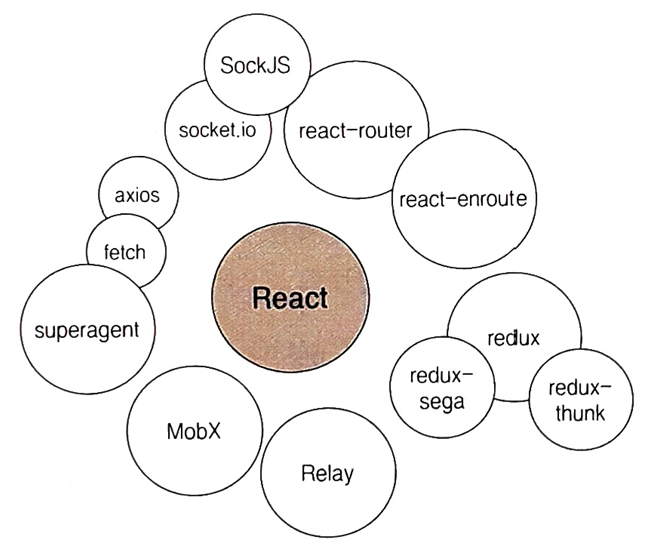

# 리액트의 이해

- 리액트는 자바스트립트 라이브러리로 사용자 인터페이스를 만드는 데 사용합니다. 구조가 MVC, MVW 등의 프레임워크와 달리 **오직 V(View)만 신경쓰는 라이브러리입니다.**
- 리액트 프로젝트에서 특정 부분이 어떻게 생길지 정하는 선언체가 있는데, 이를 컴포넌트(component)라고 합니다. 컴포넌트는 다른 프레임워크에서 사용자 인터페이스를 다룰 때 사용하는 템플릿과는 다른 개념입니다. 템플릿은 보통 데이터셋이 주어지면 HTML 태그 형식을 문자열로 반환하는데, 이와 달리 컴포넌트는 좀 더 복합적인 개념입니다. 컴포넌트는 재사용이 가능한 API로 수많은 기능들을 내장하고 있으며, 컴포넌트 하나에서 해당 컴포넌트의 생김새와 작동 방식을 정의합니다.
- 사용자 화면에 뷰를 보여주는 것을 렌더링이라고 합니다. 리액트 라이브러리는 뷰를 어떻게 렌더링하길래 데이터가 변할 때마다 새롭게 리렌더링하면서 성능을 아끼고, 최적의 사용자 경험을 제공할 수 있을까요? 이 비밀을 파악하려면 리액트 컴포넌트가 최초로 실행한 '**초기 렌더링**'과 컴포넌트의 데이터 변경으로 다시 실행되는 '**리렌더링**' 개념을 이해해야 합니다.

## 초기 렌더링
- 어떤 UI 관련 프레임워크, 라이브러리를 사용하든지 간에 맨 처음 어떻게 보일지를 정하는 초기 렌더링이 필요합니다. 리액트에서는 이를 다루는 render 함수가 있습니다.

```javascript
render() { ... }
```

- 이 함수는 컴포넌트가 어떻게 생겼는지 정의하는 역할을 합니다. 이 함수는 html 형식의 문자열을 반환하지 않고, 뷰가 어떻게 생겼고, 어떻게 작동하는지에 대한 정보를 지닌 객체를 반환합니다. 컴포넌트 내부에는 또 다른 컴포넌트들이 들어갈 수 있습니다. 이때 render 함수를 실행하면 그 내부에 있는 컴포넌트들도 재귀적으로 렌더링합니다. 이렇게 최상위 컴포넌트의 렌더링 작업이 끝나면 지니고 있는 정보들을 사용하여 HTML 마크업(markup)을 만들고, 이를 우리가 정하는 실제 페이지 DOM 요소 안에 주입합니다.



- 컴포넌트를 실제 페이지에 렌더링할 때는 분리된 두 가지 절차를 따릅니다.
  - 문자열 형태의 HTML 코드를 생성됩니다.
  - 특정 DOM에 해당 내용을 주입하면 이벤트가 적용됩니다.


## 조화 과정 

- 리액트에서 뷰를 업데이트할 때는 "업데이트 과정을 거친다"라고 하기 보다는 "<b>조화 과정(reconciliation)</b>을 거친다"라고 하는 것이 더 정확한 표현입니다. 컴포넌트에서 데이터에 변화가 있을 때 변화에 따라 뷰가 변형되는 것처럼 보이지만, 사실 새로운 요소로 갈아 끼우기 때문입니다.
- 이 작업은 render 함수가 맡아서 합니다. 컴포넌트는 데이터를 업데이트했을 때 단순히 업데이트한 값을 수정하는 것이 아니라, 새로운 데이터를 가지고 render 함수를 또 다시 호출하고 그 데이터를 지닌 뷰를 생성해 냅니다.
- 하지만 이때 render 함수가 반환하는 결과를 곧바로 DOM에 반영하지 않고, 이전에 render 함수가 만들었던 컴포넌트 정보와 현재 render 함수가 만든 컴포넌트 정보를 비교합니다.



- 자바스크립트를 사용하여 두 가지 뷰를 최소한의 연산으로 비교한 후, 둘의 차이를 알아내 최소한의 연산으로 DOM 트리를 업데이트하는 것



- 결국 방식 자체는 루투 노드부터 시작하여 전체 컴포넌트를 처음부터 다시 렌더링하는 것처럼 보이지만 사실 최적의 자원을 사용하여 이를 수행하는 것입니다.

# 리액트의 특징

## Virtual DOM

> 리액트의 주요 특징 중 하나는 Virtual DOM을 사용하는 것입니다.


### DOM이란?

- DOM은 Document Object Model의 약자입니다. 즉, 객체로 문서 구조를 표현하는 방법으로 XML이나 HTML로 작성합니다.
- 웹 브라우저는 DOM을 활용하여 객체에 자바스크립트와 CSS를 적용합니다. DOM은 트리 형태라서 특정 노드를 찾거나 수정하거나 제거하거나 원하는 곳에 삽입할 수 있습니다.



### DOM은 과연 느릴까?

- DOM에는 치명적인 한 가지 문제점이 있습니다. 바로 동적 UI에 최적화되어 있지 않다는 것. HTML은 자체적으로는 정적입니다. 자바스크립트를 사용하여 이를 동적으로 만들 수 있습니다.
- 요즘 흔히 접하는 큰 규모의 웹 애플리케이션, 예를 들어 트위터나 페이스북을 생각해 보면, 스크롤바를 내릴수록 수많은 데이터가 로딩됩니다. 그리고 각 데이터를 표현하는 요소(element)들이 있습니다. 요소 갯수가 몇 백개, 몇 천 개 단위로 많다면 이야기는 달라집니다. 이렇게 규모가 큰 웹 애플리케이션에서 DOM에 직접 접근하여 변화를 주다 보면 성능 이슈가 조금씩 발생하기 시작합니다. 즉 느려지게 됩니다. 일부 문서에서는 이를 두고 "요즘 자바스크립트 엔진은 매우 빠른 반면 DOM은 느리다"라고 하는데, 정확한 말은 아닙니다.
- DOM 자체는 빠릅니다. DOM 자체를 읽고 쓸 때의 성능은 자바스크립트 객체를 처리할 때의 성능과 비교하여 다르지 않습니다. 단, 웹 브라우저 단에서 DOM에 변화가 일어나면 웹브라우저가 CSS를 다시 연산하고, 레이아웃을 구성하고, 페이지를 리페인트 합니다. 이 과정에서 시간이 허비되는 것입니다.


### 해결법

- HTML 마크업을 시각적인 형태로 변환하는 것은 웹 브라우저가 하는 주 역할이기 때문에 이를 처리할 때 컴퓨터 자원을 사용하는 것은 어쩔 수 없습니다. DOM을 조작할 때마다 엔진이 웹 페이지를 새로 그리기 때문에 업데이트가 너무 잦으면 성능이 저하될 수 있습니다. 이런 문제를 해결하려면 DOM을 아예 조작하지 않을 수 없습니다. 그 대신 DOM을 최소한으로 조작하여 작업을 처리하는 방식으로 개선할 수 있습니다. 
- 리액트는 Virtual DOM 방식을 사용하여 DOM 업데이트를 추상화함으로써 DOM 처리 횟수를 최소화하고 효율적으로 진행합니다.

### Virtual DOM

- Virtual DOM을 사용하면 실제 DOM에 접근하여 조작하는 대신, 이를 추상화한 자바스크립트 객체를 구성하여 사용합니다. 마치 실제 DOM의 가벼운 사본과 비슷합니다.
- 리액트에서 데이터가 변하여 웹 브라우저에 실제 DOM을 업데이트할 때는 다음 세 가지 절차를 밟습니다. 
  - 데이터를 입력하면 전체 UI를 Virtual DOM에 리렌더링합니다. 
  - 이전 Virtual DOM에 있던 내용과 현재 내용을 비교합니다.
  - 바뀐 부분만 실제 DOM에 적용합니다.



### 오해

- Virtual DOM을 사용한다고 해서 사용하지 않을 때와 비교하여 무조건 빠른 것은 아닙니다. 리액트 메뉴얼에는 다음 문장이 있습니다.

```
우리는 다음 문제를 해결하려고 리액트를 만들었습니다.
지속적으로 데이터가 변화하는 대규모 애플리케이션 구축하기
```

- 결국에는 적절한 곳에 사용해야 리액트가 지닌 진가를 비로소 발휘할 수 있습니다. 리액트를 사용하지 않아도 코드 최적화를 열심히 하면 DOM 작업이 느려지는 문제를 개선할수 있고, 또 작업이 매우 간단할 때는(예: 단순 라우팅 정도만 있는 정적 페이지) 오히려 리액트를 사용하지 않는 편이 더 나은 성능을 보이기도 합니다.
- 리액트와 Virtual DOM이 언제나 제공할 수 있는 것은 바로 업데이트 처리 간결성입니다. UI를 업데이트 하는 과정에서 생기는 복잡함을 모두 해소하고, 더욱 쉽게 업데이트에 접근할 수 있습니다.

## 기타 특징

- 일부 웹 프레임워크가 MVC 또는 MVW 등의 구조를 지향하는 것과 달리 리액트는 오직 뷰만 담당합니다. 다시 한 번 강조하면 리액트는 프레임워크가 아니라 라이브러리입니다. 다른 웹 프레임워크가 Ajax, 데이터 모델링, 라이팅 등과 같은 기능을 내장하고 있는 반면, 리액트는 정말 뷰만 신경 쓰는 라이브러리이므로 기타 기능은 직접 구현하여 사용해야 합니다. 
- 하지만 그렇다고 걱정할 필요는 없습니다. 다른 개발자들이 만든 라이브러리, 즉 라우팅에는 리액트 라우터(react-router), Ajax 처리는 axios나 fetch. 상태 관리에는 리덕스(redux)나 Mobx를 사용하여 빈 자리를 채우면 됩니다. 해당 분야에서 마음에 드는 라이브러리를 사용하면 되니까 자신의 취향대로 스펙을 설정할 수 있다는 장점이 있지만, 여러 라이브러리를 접해야 한다는 단점은 있습니다.



- 리액트는 다른 웹 프레임워크나 라이브러리와 혼용할 수도 있습니다. 예를 들어 Backbone.js, AngularJs 등의 프레임워크와 함께 언제든지 사용할 수 있습니다.


# 작업환경 설정

## Node.js와 npm 설치

- Node.js 공식 다운로드 페이지에서 Windows Installer를 내려받아 설치합니다.
- 설치가 끝나면 터미널(또는 명령 프롬프트) 창을 열고, 다음 명령어를 입력하여 제대로 설치했는지 확인합니다.

```
node -v
```

## yarn

- yarn은 npm을 대체할 수 있는 도구로 npm보다 더 빠르며 효율적인 캐시 시스템과 기타 부가 기능을 제공합니다.

### 설치 

- npm의 글로벌 설치 기능을 통하여 yarn을 설치할 수 있습니다.

```
npm install --global yarn
```

### 설치 확인

- 터미널을 열고 다음 명령어를 입력하여 yarn을 제대로 설치했는지 확인하세요.

```
yarn --version
```

## 에디터 설치

- VS Code 공식 내려받기 페이지(https://code.visualstudio.com/download)에서 운영체제에 맞는 버전을 설치하세요.

### VS Code 확장 프로그램 설치

- **ESLint** : 자바스크립트 문법 및 코드 스타일을 검사해 주는 도구입니다.
- **Reactjs Code Snippets** : 리액트 컴포넌트 및 라이프사이클 함수를 작성할 때 단축 단어를 사용하여 간편하게 코드를 자동으로 생성해 낼 수 있는 코드 스니펫 모음입니다. 검색했을 때 유사한 결과가 여러 개 나올 수 있는데 제작자가 charalampos karypidis인 것을 설치하세요.
- **Prettier-Code formatter** : 코드 스타일을 자동으로 정리해 주는 도구입니다.

## create-react-app으로 프로젝트 생성하기

- create-react-app은 리액트 프로젝트를 생성할 때 필요한 웹팩, 바벨의 설치 및 설정 과정을 생략하고 바로 간편하게 프로젝트 작업 환경을 구축해 주는 도구입니다. 나중에 설정을 커스터마이징해야 하면 자유롭게 설정을 변경할 수도 있습니다.
- 이 도구를 사용하는 방법은 매우 간단합니다. 터미널을 열고 프로젝트를 만들고 싶은 디렉터리에서 다음 명령어를 실행하세요.

```
yarn create react-app hello-react
```


> **yarn을 사용하지 않는 경우**
> 
> yarn을 사용하지 않는 경우라면 다음 명령어를 사용하여 리액트 프로젝트를 생성할 수 있습니다.
> 
> npm init react-app <프로젝트 이름>

- 프로젝트 생성이 완료되었다면 다음 명령어를 입력하여 프로젝트 디렉터리로 이동한 후 리액트 개발 전용 서버를 구동해 보세요.

```
cd hello-react
yarn start
```

- 브라우저에서 자동으로 리액트 페이지가 띄어질 것입니다. 만약 페이지가 자동으로 열리지 않았다면 주소창에 다음 링크를 직접 입력하여 열어보세요.

```
http://localhost:3000
```